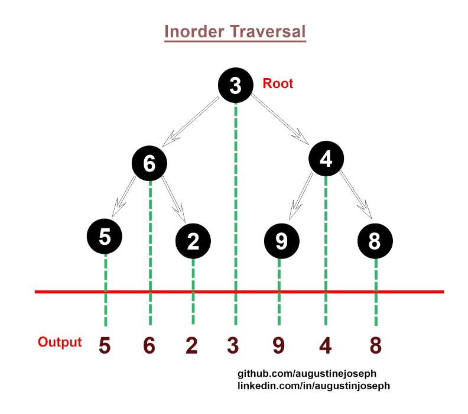
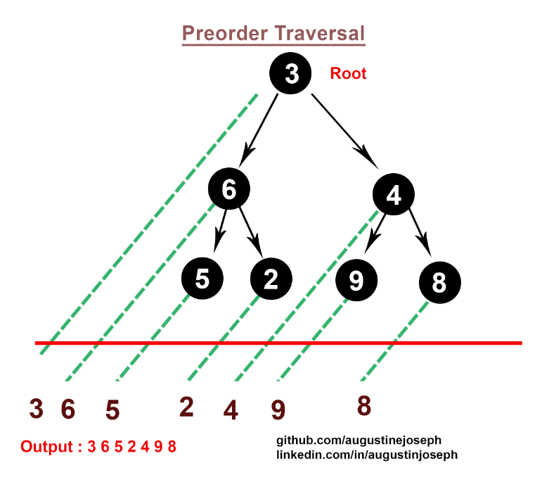
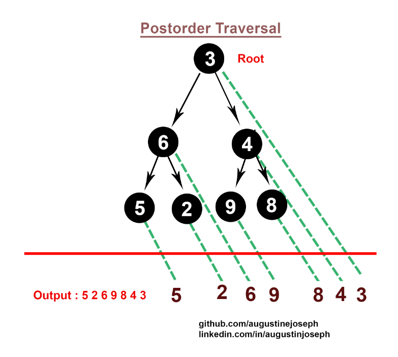

# Tree
A tree data structure is defined as a collection of objects or entities known as nodes that are linked together to represent or simulate hierarchy.

A tree data structure is a non-linear data structure because it does not store in a sequential manner. It is a hierarchical structure as elements in a Tree are arranged in multiple levels.

> ### **Linear Data Structure:**
> Linear data structures organize elements in a sequential manner. Examples include arrays, linked lists, stacks, and queues.
> ### **Non-linear Data Structure:**
> Non-linear data structures do not follow a sequential order. Examples include trees, graphs, heaps, and hash tables.

</br>
<hr>

## Features of a tree data structure
1. **Root**: The root node is the topmost node in the tree structure. It serves as the starting point for accessing all other nodes in the tree. There is only one root node in a tree.

2. **Node:** A node is an element within the tree that holds data and references to its child nodes, if any. Each node can have zero or more child nodes. Nodes can store any kind of data, depending on the specific application or problem being solved.

3. **Edge:** An edge is a connection or link between nodes in the tree. It represents the relationship between nodes, showing the flow of data or hierarchy. Each node, except the root, has exactly one incoming edge from its parent node. Nodes can have multiple outgoing edges to connect to their child nodes.

4. **Parent and Child Nodes:** Nodes in a tree are connected in a parent-child relationship. A parent node is a node that gives rise to its child nodes. A child node is a node that is directly connected to its parent node. Each child node has a unique parent, but a parent node can have multiple child nodes.

5. **Leaf Nodes:** Leaf nodes are nodes at the bottom of the tree that have no children. They represent the end points of a branch in the tree structure. Leaf nodes are sometimes referred to as terminal nodes or external nodes.

6. **Depth:** The depth of a node is the number of edges between that node and the root node. The root node has a depth of 0, and the depth of any other node is one more than the depth of its parent node.

7. **Height:** The height of a tree is the maximum depth among all the nodes in the tree. In other words, it is the length of the longest path from the root node to any leaf node. The height of a tree can be used to measure its overall size or efficiency.


</br>
<hr>

## Tree Traversal
Traversing a tree means visiting every node in the tree.

There are three types of traversal:
1. Inorder Traversal
2. Preorder Traversal
3. Postorder Traversal

</br>

## **Inorder Traversal**

#### **Algorithm Inorder**
> ```
> First, visit all the nodes in the left subtree; call Inorder(left->subtree)
> Then the root node
> Visit all the nodes in the right subtree; call Inorder(right->subtree)
> ```
> **Time Complexity:** O(N)
> 
> If a binary tree is traversed **in-order**, the output will produce sorted key values in an **ascending order**.

</br>

## **Preorder traversal**

#### **Algorithm Preorder**
>```
>Visit root node
>Visit all the nodes in the left subtree; call Preorder(left->subtree)
>Visit all the nodes in the right subtree; call Preorder(right->subtree)
>```
>Time Complexity: O(N)

</br>

## **Postorder Traversal**

#### **Algorithm Preorder**
>```
>Traverse the left subtree; call Postorder(left->subtree)
>Traverse the right subtree; call Postorder(right->subtree)
>Visit the root
>```
>Time Complexity: O(N)